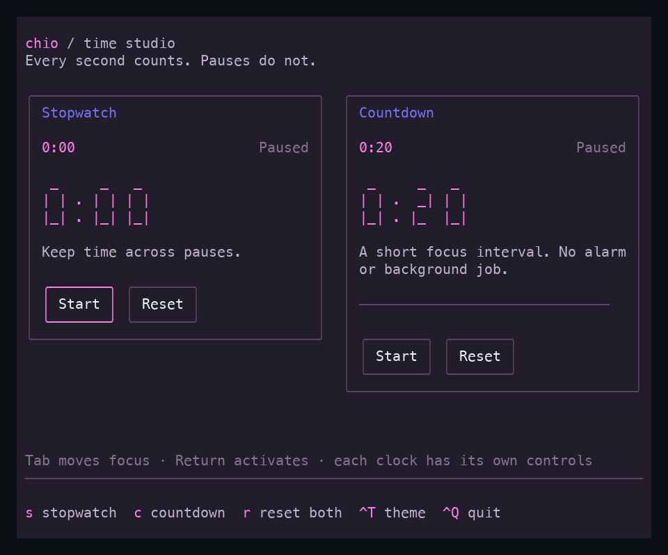
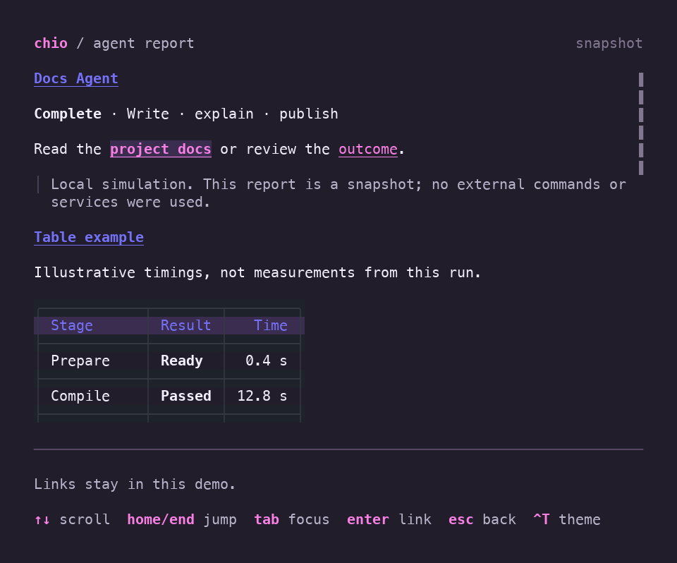
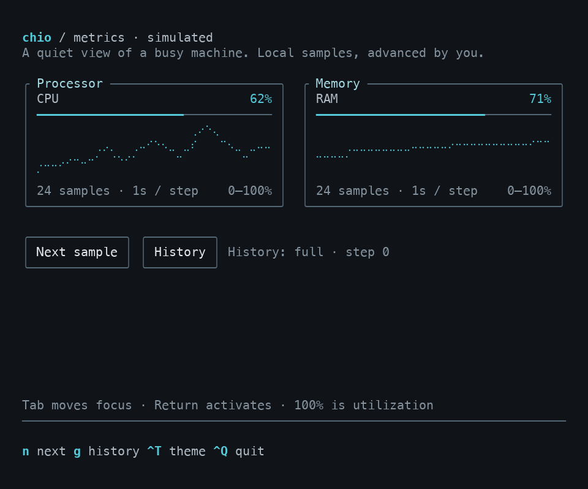
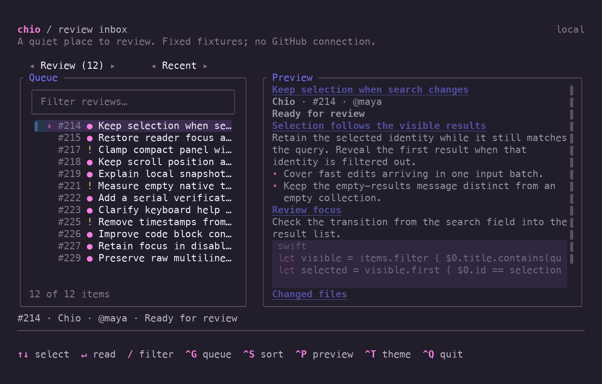
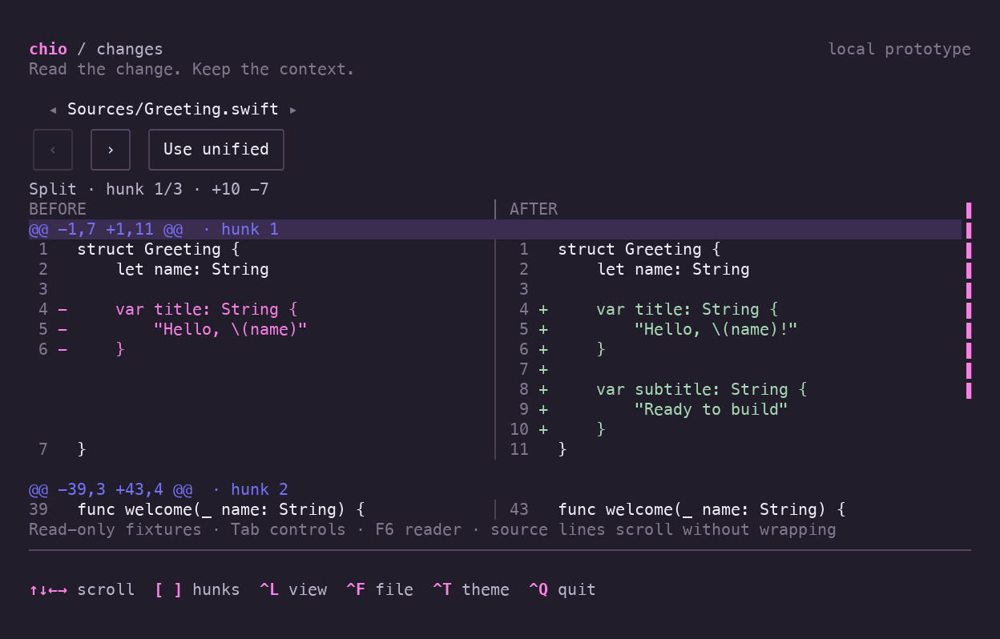

# Runnable examples

[Back to Chio](../README.md) · [API usage](Usage.md)

Run these commands from a checkout of the repository. All examples are local;
the dashboard simulates agents, while file selection reads your filesystem.

## Compare themes

Every example accepts `--theme default`, `--theme light` or `--theme btop`:

```sh
swift run -c release chio-dashboard --choices --theme btop
swift run -c release chio-dashboard --inbox --theme light
swift run -c release chio-dashboard --metrics --theme default
```

Dashboard examples use **Ctrl-T** to cycle default → light → btop while retaining
your place and entered values; the dashboard also accepts `t` while browsing.
The map example uses `t`. With no option, metrics starts in btop and other examples
start in default. Dashboard examples retain `--light` as an alias for
`--theme light`; use one option or the other.

The [showcase](https://echoz.github.io/Chio/) provides a **Static preview** theme
selector beside each example. These previews render the same example state in
all three themes, and the launch command follows the selected theme. **Play
original recording** opens the interaction recording, whose own theme changes
remain part of that recorded session.

Themes change styling, not terminal color support. For true-color terminals over
SSH, see [Colors over SSH](#colors-over-ssh).

## Maps

The map example composes Chio’s public `MapView` with offline world and street
sources and a synthetic guide with named locations and an application-authored route:

```sh
swift run -c release chio-maps --map world
swift run -c release chio-maps --map street --theme btop
swift run -c release chio-maps --map street --detail minimal
```

Use `--map` for world/street selection; `--scene` retains SwiftTUI’s native
web-host scene meaning. Start at **100 × 30**. Arrows pan, `+`/`-` zoom,
`n`/`p` select and center the next/previous location, and Return activates the
selected location with local feedback. Tab leaves the map through native focus.
Space switches world/Singapore, `t` cycles themes, `[` lowers detail, `]` raises
it, and `d` cycles all four levels. `f` toggles area fills, `l` toggles labels,
`r` resets the camera, and `q` quits.

Minimal is the default: water, broad coastline shapes and major roads. Choose
`--detail silhouette`, `minimal`, `abstract`, or `source`. Silhouette shows land
and water; abstract adds parks and scale-dependent smaller streets; source shows
all supported source feature classes. Silhouette and minimal simplify boundaries
at the current terminal scale. Abstract and source retain original polygon shapes.
Lower levels omit smaller areas and reduce background labels. Locations and routes
remain application-authored overlays, independent of geographic detail. Brackets
stop at the ends; `d` wraps. Changes preserve the camera and retained source geometry.

The world uses Natural Earth land; the neighborhood uses OpenStreetMap vectors
around Marina Bay. The optional `--source openfreemap` selects a bundled vector
tile instead of the default normalized Overpass extract. No network request or
API key is needed. Panning does not load new areas; the coverage notice identifies
when the camera center leaves the bundled extract. Source credits remain visible.
See [fixture provenance](../Examples/Maps/Fixtures/Provenance.md).

To load new areas as you pan, explicitly enable online acquisition:

```sh
swift run -c release chio-maps --online --map street
```

This discovers OpenFreeMap without a key, requests the visible tiles, and retains
previous coverage while replacements load. The status row reports loading,
failure, or reduced source resolution when data exceeds geometry budgets. Press
`e` to retry using the loader's cache policy. The world overview stays bundled;
zooming into spans below 45 degrees enables online tiles. `--source` selects an
offline fixture and is not needed online. Detail and theme changes do not fetch
new data. No disk cache or background download is created. Online snapshots and
benchmarks are rejected so the inspection modes remain deterministic.

Use `--online --tile-source source.json` to load an explicitly configured
OpenMapTiles-compatible endpoint. The file is a JSON-encoded `OpenMapTilesSource`
(up to 16 KiB), including attribution and supported zooms. This bypasses discovery.
For a reproducible local HTTP replay, run
`python3 Scripts/maps/online-fixture-server.py --config-file .build/maps-source.json`
in one terminal, then add `--tile-source .build/maps-source.json` to the online
launch in another. The replay configuration uses three retained z12 tiles and deliberately
returns an error outside that coverage; it never accesses the Internet.

Give the component at least **32 × 16** drawing cells for longitude spans of
60 degrees or more, or **58 × 16** for closer views, plus two credit rows.
Smaller allocations show a resize summary while preserving the camera and
selection. Try **60 × 26** or larger with ordinary 2:1 terminal cells. Drawing
work is checked before painting; overload shows “Too much map detail” with
controls retained. Lower detail, change scale or disable fills to recover.

See [MapView usage](Usage.md#maps) for source adapters, camera and selection
bindings, overlays and activation. Applications own loading, network policy,
location meaning and route calculation. The example’s `--snapshot`,
`--snapshot-json` and `--benchmark` exports support inspection; they do not
establish live SSH latency or appearance in every terminal. For a true-color
SSH terminal, prefix the launch with `COLORTERM=truecolor`.

## Dashboard

Use Swift 6.4 or later on macOS 15 or later, matching the pinned upstream requirements:

```sh
swift run -c release chio-dashboard
```

Use release mode for interactive use. SwiftTUI enables additional verification
in debug builds; plain `swift run` uses debug mode and can feel noticeably slower.

Or build once and run the binary directly:

```sh
swift build -c release --product chio-dashboard
.build/release/chio-dashboard
```

Use arrows to navigate, `/` to search, Enter to open a report, and Escape to clear search.
While browsing: `r` starts a run, `f` simulates failure, `p` pauses progress,
`e` toggles empty data, `t` changes theme, and `q` quits. Ctrl-C also exits.
The `›` marker is selection; the native `▌` shows the current list navigation
target. Tab moves native focus; Enter opens the selected agent's report.

Press **Ctrl-K** for the command palette, including while editing the dashboard
search. Type to filter actions, use arrows or Tab/Shift-Tab to select, Enter to
run, and Escape to cancel. Create an agent, run/retry the selected agent, open its
report, change theme, or pause/resume the demo from this menu. Cancel returns to
the same search and focus; actions requiring selection are disabled when absent.

Reports capture the run at the moment you open them. Use arrows or Home/End to
scroll, Ctrl-T to change theme, and Escape to return to the same selection and
filter. Reopen for the latest run state. The reports demonstrate headings, rich
text, lists, quotes, code, and tables. Tab first focuses **project docs**, then
**outcome** in the paragraph near the top. Enter reports the exact destination in
the persistent footer; activation stays local, without opening a browser or making
a network request. Reopening clears this feedback.

Continue with Tab to focus the **Table example**, which shows aligned columns and
illustrative timings; left/right scroll it on narrow screens. Later, Tab can focus
a code block, where left/right scroll long lines. Shift-Tab moves backward through
these native focus targets to vertical reading. Ctrl-T and Escape remain available
while a link owns focus. Links wrap with their surrounding paragraph as the terminal
narrows; try 36 × 18 with a link focused.

Under **Example workflow**, the Swift `RunSummary` sample shows five syntax colors
from the current theme. Ctrl-T changes their palette; Tab focuses the code and
End reveals the long text line. The shell commands above it remain plain. These
examples are displayed as source and are never executed by the report.

Press `n` while browsing to create an agent. Enter its name, choose a role with
the arrow keys, and use Space to toggle Start immediately. Test agents also
require a suite name. Tab and Shift-Tab move between controls. Create or Ctrl-S
submits; Return in a text field also submits. Invalid submission shows inline
errors and focuses the first invalid field. Escape cancels; Ctrl-T changes theme
while preserving the draft. Successful creation clears the filter and selects
the new agent. Created agents are simulated and last only for the current session.

Try 100 × 30 for the full dashboard. Narrow windows stack the sections; short
windows prioritize the list and essential hints. The compact layout fits 36 × 18.

Capture deterministic plain-text frames without a terminal:

```sh
swift run chio-dashboard --snapshot --width 100 --height 30
swift run chio-dashboard --snapshot --width 50 --height 30 --scenario failed
```

Other scenarios are `empty`, `no-matches`, and `completed`. Use `--light` for the
alternate palette or `--paused` to start an interactive demo without advancing
the simulation.

Linux verification uses Swift 6.4.0 on Ubuntu 24.04. Ordinary Linux builds use
glibc and need the Swift runtime libraries; they are not self-contained binaries.
Static Linux distribution is a [separate compatibility check](Decisions/Dependencies.md#static-linux-blocker).

## Review inbox

```sh
COLORTERM=truecolor swift run -c release chio-dashboard --inbox
```

Browse sixteen local review fixtures using arrows and `/` to filter by title,
repository, author or number. The native **Queue** and **Sort order** pickers also
work with Tab and arrows. Ctrl-G cycles Review, Drafts and All; Ctrl-S switches
between recent and repository ordering. Sorting retains the selected identity.
Filtering or changing queue selects the first match if the old selection disappears.
An empty result set has no preview and cannot open a reader.

At 88 × 26 and larger, a passive Markdown preview sits beside the dense list.
Both panes expand as the terminal widens, with more space reserved for reading.
Ctrl-P toggles the preview; hiding it or using a smaller terminal gives the list
the whole width. Enter opens
a full-screen reader at any size; from search, the first Enter returns to results
and the second opens the selected review. In the reader, arrows and Home/End
scroll, Tab reaches code, and Escape restores the filtered list and native focus.
Ctrl-T changes theme; Ctrl-Q quits from the inbox. Resizing retains the query and
selection, and an open reader stays open until dismissed.

These are fixed snapshots, with no GitHub connection, current clock or repository
operations. Use `--inbox --snapshot --width 36 --height 18` for a compact frame.
Watch the [inbox recording](https://echoz.github.io/Chio/#inbox).

## Diff reader prototype

```sh
swift run -c release chio-dashboard --diff
```

Read six fixed local file examples: a three-hunk change, Unicode and long source
lines, empty additions/deletions, a rename, and binary content. This is an
example prototype built from native text, scrolling and existing Chio styles;
it does not expose a public diff component or read your repository.

Arrow keys and Home/End use native scrolling. `[` and `]` jump between hunks while
the reader is focused. Ctrl-L switches unified/split views; below 92 columns the
reader uses unified rows and restores your preference when widened. Ctrl-F cycles
files, Ctrl-T changes theme, and Ctrl-Q quits. Tab reaches the file picker and
buttons; F6 returns to the reader. Resize or change layout to retain the selected
hunk. The hunk indicator records the last navigation target, not your manual
scroll position.

Source lines scroll horizontally without wrapping, preserving authored spaces
and blank lines. Split panes share one scroll position; very long lines can push
the right pane offscreen. Native SwiftTUI measures Unicode cells and tabs, so this
is not a terminal-independent source editor. Large diffs, selection/copy,
syntax highlighting and VCS ingestion are outside this prototype.

Use `--diff --snapshot --width 36 --height 18` for a compact frame. Watch the
[diff recording](https://echoz.github.io/Chio/#diff).

## Choice fields

Run the focused two-step form using the same executable:

```sh
COLORTERM=truecolor swift run -c release chio-dashboard --choices
```

Search for a language and press Enter to continue, then choose one to three
capabilities. In the checklist, Enter leaves search for native rows; arrows move
focus and Space or Enter toggles a check. `/` returns to search and Escape clears
the filter. Checked items stay selected when a filter hides them. Deploy is
visible but unavailable in this local demo.

Ctrl-S advances or saves, Ctrl-B goes back, and Ctrl-X cancels and restores the
original choices. Ctrl-R resets the draft, Ctrl-T changes theme, and Ctrl-Q quits.
Save validates the complete selection, including hidden checks; it never silently
truncates it. The example keeps its saved summary only for the current process.
Use `--choices --snapshot` for a noninteractive language-page capture.

## Text entry

```sh
COLORTERM=truecolor swift run -c release chio-dashboard --text-entry
```

Enter a made-up password and some notes. Tab and Shift-Tab move between the
native controls; Return in Notes inserts a newline, and multiline paste keeps
its line breaks. Ctrl-S validates the demo's eight-character password minimum
and required notes, then clears the password and shows acceptance. Nothing is
authenticated, sent, or persisted. Ctrl-X clears both fields; Ctrl-D locks or
unlocks editing; Ctrl-T changes theme; Ctrl-Q quits. The example fits 36 × 18.
Use `--text-entry --snapshot` for a deterministic capture.

See [text-entry composition](Usage.md#text-entry) for the Swift API.

## Confirmation and feedback

```sh
COLORTERM=truecolor swift run -c release chio-dashboard --feedback
```

Press Publish (or Ctrl-P), then Tab to Cancel or Publish and press Return.
Escape dismisses the prompt. A local simulated publish shows the native spinner,
then a success toast that expires after three seconds. Discard (Ctrl-D) becomes
available after completion and opens a destructive confirmation. On the main screen, Ctrl-T changes
theme and Ctrl-Q quits. Nothing is sent or persisted. The example fits 36 × 18;
`--feedback --snapshot` captures its initial state without a terminal.

See [prompt and toast styling](Usage.md#confirmation-and-feedback) for the Swift API.

## File selection

```sh
COLORTERM=truecolor swift run -c release chio-dashboard --files
# Or start in a particular folder:
COLORTERM=truecolor swift run -c release chio-dashboard --files --directory ./Sources
```

Use arrows to select, `/` to filter names in the current folder, and Return to
enter a folder or choose a file. Parent or Backspace at results moves up. Escape
clears the filter; Cancel or Ctrl-G cancels without replacing a previous choice.
Ctrl-O reopens after a result, Ctrl-T changes theme, and Ctrl-Q quits.
The example reads directory metadata and displays the chosen path; it does not
open file contents or modify files. `--files` requires an interactive session
and does not support `--snapshot`.

See [file-selection options](Usage.md#file-selection) for bindings and filtering policies.

## Keyboard help

```sh
COLORTERM=truecolor swift run -c release chio-dashboard --keyboard-help
```

Browse with the arrows and press `?` for grouped shortcuts. `/` enters search;
typing `?` there edits the query. F1 opens the full reference from any control,
including search. `?` shows the shortcuts for the current browsing/action context.
Tab focuses the native help viewport or Close button; arrows, Page Up/Down and
Home/End scroll the viewport.
Escape closes help and restores the control you were using, retaining the filter
and selected agent.

Run, Return on a selected agent, or Ctrl-R increments a local counter. An empty
result set disables Run and omits it from expanded help. Ctrl-T switches theme,
and Ctrl-Q quits. Try resizing with help open: the example fits 36 × 18.
`--keyboard-help --snapshot` captures the initial browser state.

See [expanded keyboard help](Usage.md#expanded-keyboard-help) for the shared
descriptions and native presentation.

## Tabs

```sh
COLORTERM=truecolor swift run -c release chio-dashboard --tabs
```

Left/Right chooses a tab; Return or Space opens it. Tab moves into its controls,
and F6 returns to the tab strip. Run the Overview counter, type in Notes, switch
away and back: both retain their values. Agents offers filtering, Activity is a
native scroll view, and Settings contains a local toggle.

Resize to 36 × 18 to try More: choose a hidden tab with the arrows, open the menu
with Down or Return, then use Up/Down and Return to activate an entry. Escape
closes the menu. Ctrl-T changes theme, Ctrl-Q quits, and `--light` starts light.
`--tabs --snapshot` captures the initial frame. Everything stays in the current
process; no files are written or services called.

## Pagination

```sh
COLORTERM=truecolor swift run -c release chio-dashboard --pagination
```

Type `build` to filter the local history. Tab moves through the filter, rows-per-page
picker, native viewport and available page buttons. Return/Space activates a page
button; Left/Right and Home/End navigate while those buttons have focus. The same
keys keep their normal meaning in the filter, picker and viewport.

Change the page size from three to five rows to keep the old first visible run
on the new page. Try a filter with no matches to see the empty state. Ctrl-R resets
the filter and returns to the first page, Ctrl-T changes theme, and Ctrl-Q quits.
Resize to 36 × 18 to try the compact layout; the viewport scrolls within a page.
`--pagination --snapshot` captures the first page. The records are a local simulation.

## Scrolling

```sh
COLORTERM=truecolor swift run -c release chio-dashboard --viewport
```

Explore a wide log of forty local events. Arrows scroll vertically and
horizontally; Home/End jump vertically while the log owns focus. Tab visits the
vertical and horizontal tracks, then **Back to start**. A focused horizontal
track uses Home/End to reach the left/right edges. F6 returns focus to the log.
Wheel and track dragging use SwiftTUI's native pointer support.

Ctrl-T changes theme and Ctrl-Q quits. Try 36 × 18 to see the compact layout;
the viewport preserves its position through theme changes and native resizing.
Use `--viewport --snapshot` for a deterministic first frame. This is a local
scrolling example, not a live log reader.
The pinned SwiftTUI runtime can nudge both offsets by one cell when the log gains
focus, including through F6. Immediately after launch, Home then Left corrects
that initial nudge while keeping log focus. **Back to start** resets both offsets
from any position, retaining button focus. This is a documented native focus-reveal
limitation.

## Expandable tree

```sh
COLORTERM=truecolor swift run -c release chio-dashboard --tree
```

Tab/Shift-Tab moves between native folder groups, the viewport and the two bulk
actions. Return/Space or a click on a folder header expands or collapses it.
Closing Sources and reopening it restores its nested expansion choices; the
count includes those remembered descendants. **Collapse all** clears every
choice, while **Expand all** opens all six folders. Notes demonstrates an empty
branch. File names are passive labels in a local example; no filesystem is read.

Ctrl-T changes theme and Ctrl-Q quits. Resize to 36 × 18 to try the compact
layout. The native viewport scrolls when needed; focused expanded groups have
native focus bounds that include their contents, not just the header. Arrows
retain geometric focus navigation rather than conventional tree expand/collapse
commands. Use `--tree --snapshot` to capture the initial hierarchy.

## Grouped forms

```sh
COLORTERM=truecolor swift run -c release chio-dashboard --forms
```

Edit the workspace name, then enable **Automatic runs** to reveal interval and
timeout fields. Use Tab/Shift-Tab for native focus and Space/Return to toggle.
Both durations require whole minutes from 1 to 60; timeout must be shorter than
the interval. Hiding these fields keeps their text and excludes their rules from
manual-mode validation.

**Save**, Ctrl-S, or Return in a text field validates the current draft and
focuses the first invalid field. **Cancel** or Ctrl-X restores the latest saved
values and clears errors. Saving is local to this example: no jobs start and no
settings are written to disk. Ctrl-T changes theme; Ctrl-Q quits. Try 36 × 18 to
see the native viewport reveal focused fields while actions remain available.
Use `--forms --snapshot` for a deterministic initial frame.

## Colors over SSH

For a true-color terminal such as Blink or Ghostty, declare that capability on
the remote host when launching the dashboard:

```sh
COLORTERM=truecolor .build/release/chio-dashboard
# Or build and run:
COLORTERM=truecolor swift run -c release chio-dashboard
```

Alternatively, set it for the current remote shell, then launch normally:

```sh
export COLORTERM=truecolor
```

Use this when the connecting terminal supports true color. Setting it in the
remote shell needs no SSH client/server configuration change and lasts for that
shell session. Chio leaves color capability and overrides to the application
and terminal runtime; importing the library does not force true-color output.

SSH may not forward `COLORTERM`. The pinned SwiftTUI chooses text color depth
from environment variables; it does not query the terminal for true-color support
or consult terminfo. For an interactive terminal with color enabled:

| Remote environment | Selected output |
| --- | --- |
| `COLORTERM=truecolor` or `24bit` | True color |
| Missing/empty `COLORTERM`, `TERM=xterm-256color` | 256 colors |
| Missing/empty `COLORTERM`, `TERM=xterm-ghostty` | 16 colors |

The reported Blink and Ghostty SSH sessions both had empty `COLORTERM`, with
`TERM=xterm-256color` and `TERM=xterm-ghostty` respectively. Those values describe
what reached the remote process, not the connecting terminals' full capabilities.

Check the environment in the remote shell that launches the dashboard, rather
than in the local terminal. `TERM=xterm-ghostty` alone is not recognized as a
true-color capability by this pin. `TERM_PROGRAM` does not affect its color-depth
decision. The launch prefix above preserves the authored RGB palette and applies
only to that process. `NO_COLOR` remains respected; `--force-color` does not select
true color.

For persistent forwarding, the SSH client must send `COLORTERM` and the server
must allow it through `AcceptEnv`. Ghostty documents both sides in its
[SSH guide](https://ghostty.org/docs/features/ssh). Reconnect after changing
forwarding configuration and check the remote value before launching Chio.

Missing capability information and poor palette conversion are separate issues.
With 256 colors selected, the pinned converter maps Chio's dark plum background
(`#211D2A`) to gray (`#5F5F5F`). Correcting that converter will not make a true-color
terminal advertise its capability, nor change Ghostty's 16-color fallback above.

## Timers and stopwatches

```sh
COLORTERM=truecolor swift run -c release chio-dashboard --timers
```

This demonstrates Chio's `DurationText` presentation. Timekeeping and controls
are example-owned application code, not a public stopwatch component.
Run a stopwatch and a 20-second countdown independently. Tab moves between native
buttons; Return or Space activates them. `s` starts, pauses or resumes the stopwatch,
`c` does the same for the countdown, and `r` resets both to their paused initial
values. Each panel also has its own Reset button. At expiry the countdown stops
at zero with a Complete status; reset it for another round. Ctrl-T changes theme
and Ctrl-Q quits. These clocks run only in this local process, without alarms or
background jobs. Both panels and their controls fit 36 × 18.

Use `--timers --snapshot` for a deterministic initial frame.
See [duration labels](Usage.md#duration-labels).

## Compact metrics

```sh
COLORTERM=truecolor swift run -c release chio-dashboard --metrics
```

Compact border titles, measurement tracks and single-series sparklines share the
btop-inspired palette. Press `n` or activate **Next sample** to advance the local
24-sample history. Press `g` or activate **History** to cycle through full, missing
and empty readings. Tab/Shift-Tab moves between native buttons; Return/Space
activates them. Ctrl-T cycles btop, default and light themes; Ctrl-Q quits.

The application owns the sample sequence and history updates. No clock runs and
no system metrics are collected. Resize to compare wide and compact layouts.
Use `--metrics --snapshot` for a deterministic initial frame.
See [compact metrics and history](Usage.md#compact-metrics-and-history) for the APIs
and scale, gap and accessibility contracts.

## Gallery and recordings

[Watch the recordings in your browser](https://echoz.github.io/Chio/), with pause,
seeking, and fullscreen playback. These are recorded examples; run the binary to
interact with the controls yourself.

The gallery groups reusable views, maps and native control styles under **Components**.
The dashboard, metrics, inbox, and diff prototype are **Compositions** of those building blocks.
Each recording lists the Chio APIs, native SwiftTUI controls, and application-owned
behavior it uses, with a link to its example source.


The local agent dashboard combines native controls with Chio's theme, searchable
selection, progress styling, and contextual help.
[Watch](https://echoz.github.io/Chio/#dashboard) · [Download recording](Media/dashboard.cast).

### Searchable choices and light-theme feedback


Checked membership stays distinct from keyboard focus. Filtering can hide a
checked item without removing it from the application's selection.
[Watch](https://echoz.github.io/Chio/#choices) · [Download recording](Media/choices.cast).


The same semantic theme roles apply to the light palette. Focused buttons use an
accent outline and preserve the surrounding surface.
[Watch](https://echoz.github.io/Chio/#feedback) · [Download recording](Media/feedback-light.cast).

### Paginated history


Filter local runs, move between pages, and change the page size while keeping the
previously visible run in the new window. Empty results have no active page.
[Watch](https://echoz.github.io/Chio/#pagination) · [Download recording](Media/pagination.cast).

### Scrolling and expandable trees


Navigate a wide local log, change theme and try a compact terminal. Native
scrolling owns the position; Chio supplies semantic indicator colors.
[Watch](https://echoz.github.io/Chio/#viewport) · [Download recording](Media/viewport.cast).


Fold nested groups while keeping their expansion choices, then change theme or
resize. The hierarchy is authored local example data; it does not read files.
[Watch](https://echoz.github.io/Chio/#tree) · [Download recording](Media/tree.cast).

### Grouped settings


Conditional fields retain their draft text, related values validate together, and
Cancel restores the latest saved snapshot. The example starts no background jobs.
[Watch](https://echoz.github.io/Chio/#forms) · [Download recording](Media/forms.cast).

### Timers and stopwatches



Pause each clock independently, resume its retained interval, and follow countdown
expiry through theme and terminal-size changes.
[Watch](https://echoz.github.io/Chio/#timers) · [Download recording](Media/timers.cast).

### Markdown code, links and reports



Read highlighted Swift through theme changes and native horizontal scrolling.
Move through inline links with native focus and activate each destination locally.
Paragraph wrapping, focused links and persistent feedback
share the theme through terminal-size changes. The application chooses what
activation does; this demo opens no browser and makes no network requests.
[Watch](https://echoz.github.io/Chio/#markdown) · [Download recording](Media/markdown-links.cast).

### Compact metrics



Advance local readings, show missing or empty history, and compare the same compact
presentation across btop, default and light palettes. Measurement tracks preserve
their meaning at 100%; the application supplies data and updates.
[Watch](https://echoz.github.io/Chio/#metrics) · [Download recording](Media/metrics.cast).

### Review inbox



Sort and filter fixed local reviews, hide the wide preview, and open the full
reader. Query, selection and native focus survive theme and terminal-size changes.
[Watch](https://echoz.github.io/Chio/#inbox) · [Download recording](Media/inbox.cast).

### Read-only diff prototype



Jump between hunks, switch split/unified views, and resize into compact reading.
Existing Chio styles and native scrolling support an example-owned diff model;
empty files, renames and binary content have explicit summaries.
[Watch](https://echoz.github.io/Chio/#diff) · [Download recording](Media/diff.cast).

These previews render real release-binary terminal output. Font rendering can
vary between terminals. The accompanying Asciinema-compatible recordings replay
locally after cloning the repository:

```sh
asciinema play Docs/Media/choices.cast
```
