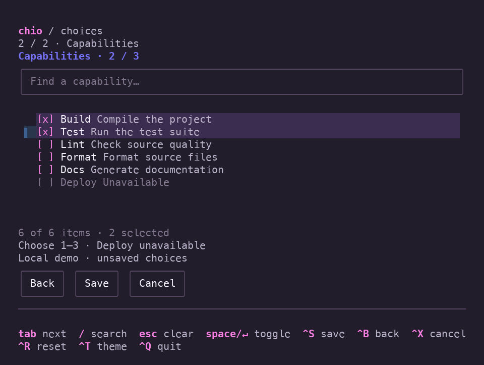
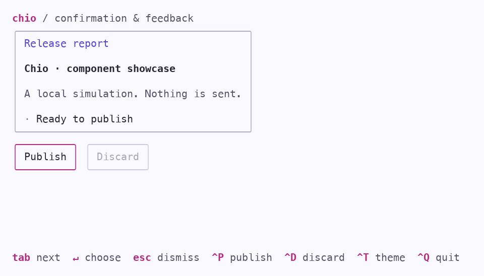
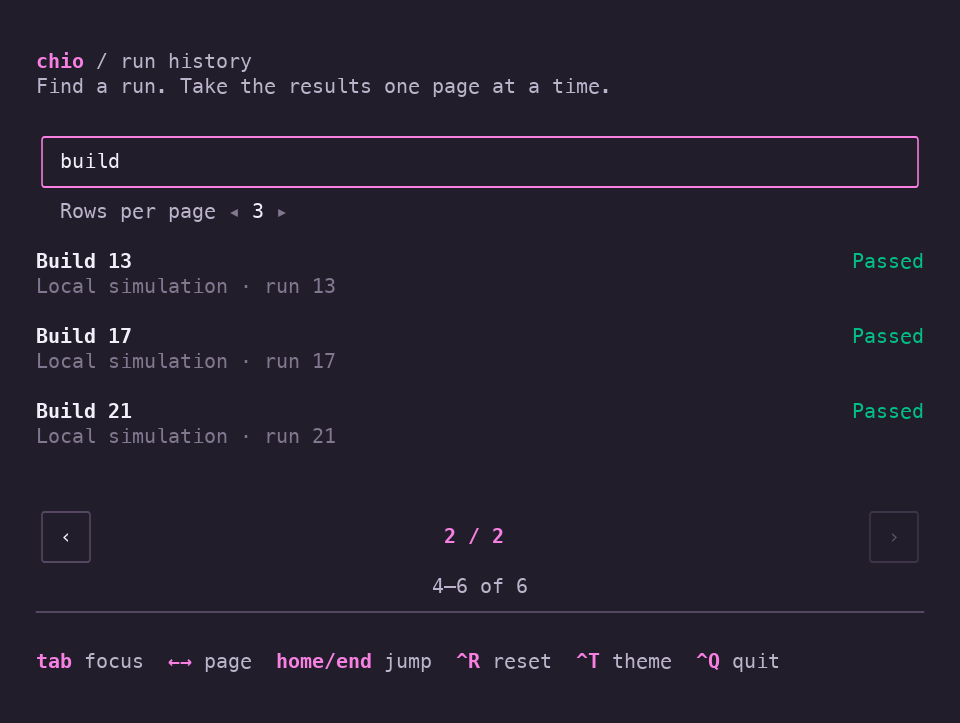
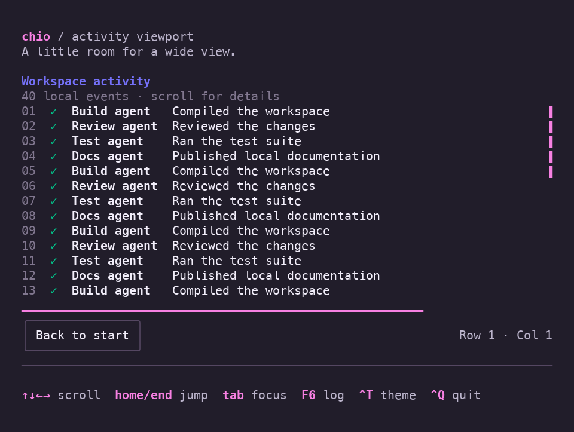
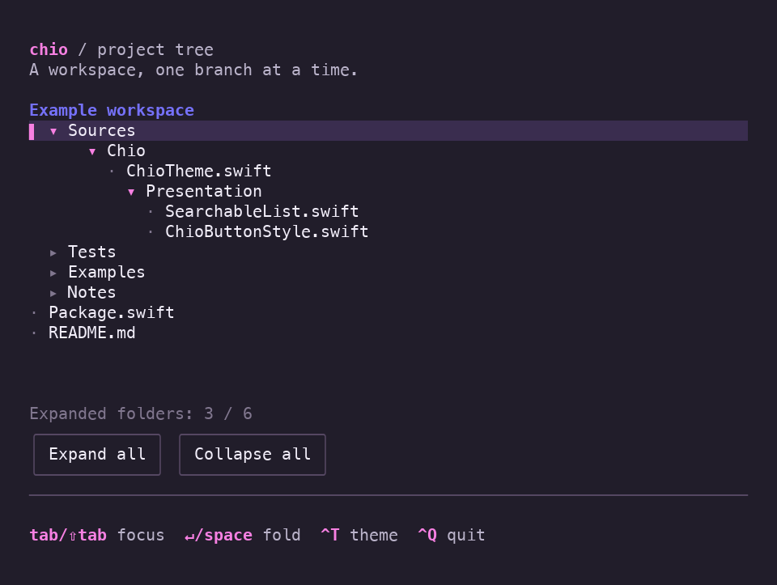
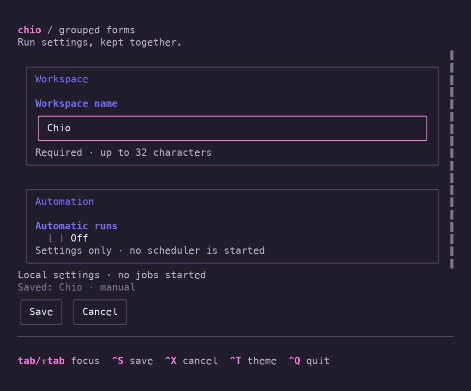

# Runnable examples

[Back to Chio](../README.md) · [API usage](Usage.md)

Run these commands from a checkout of the repository. All examples are local;
the dashboard simulates agents, while file selection reads your filesystem.

## Dashboard

Use Swift 6.4 or later on macOS 15 or later, matching the pinned upstream requirements:

```sh
swift run -c release chio-dashboard
```

Use release mode for interactive use. SwiftTUI enables additional verification
in debug builds; plain `swift run` uses debug mode and can feel noticeably slower.

Or build once and run the binary directly:

```sh
swift build -c release --product chio-dashboard
.build/release/chio-dashboard
```

Use arrows to navigate, `/` to search, Enter to open a report, and Escape to clear search.
While browsing: `r` starts a run, `f` simulates failure, `p` pauses progress,
`e` toggles empty data, `t` changes theme, and `q` quits. Ctrl-C also exits.
The `›` marker is selection; the native `▌` shows the current list navigation
target. Tab moves native focus; Enter opens the selected agent's report.

Press **Ctrl-K** for the command palette, including while editing the dashboard
search. Type to filter actions, use arrows or Tab/Shift-Tab to select, Enter to
run, and Escape to cancel. Create an agent, run/retry the selected agent, open its
report, change theme, or pause/resume the demo from this menu. Cancel returns to
the same search and focus; actions requiring selection are disabled when absent.

Reports capture the run at the moment you open them. Use arrows or Home/End to
scroll, Ctrl-T to change theme, and Escape to return to the same selection and
filter. Reopen for the latest run state. Tab can focus a code block, where left
and right scroll long lines. The reports demonstrate headings, rich text, lists,
quotes, code, and tables. The **Table example** near the top shows aligned columns
and illustrative timings. Tab focuses it; left/right scroll on narrow screens,
and Shift-Tab returns to vertical reading.

Press `n` while browsing to create an agent. Enter its name, choose a role with
the arrow keys, and use Space to toggle Start immediately. Test agents also
require a suite name. Tab and Shift-Tab move between controls. Create or Ctrl-S
submits; Return in a text field also submits. Invalid submission shows inline
errors and focuses the first invalid field. Escape cancels; Ctrl-T changes theme
while preserving the draft. Successful creation clears the filter and selects
the new agent. Created agents are simulated and last only for the current session.

Try 100 × 30 for the full dashboard. Narrow windows stack the sections; short
windows prioritize the list and essential hints. The compact layout fits 36 × 18.

Capture deterministic plain-text frames without a terminal:

```sh
swift run chio-dashboard --snapshot --width 100 --height 30
swift run chio-dashboard --snapshot --width 50 --height 30 --scenario failed
```

Other scenarios are `empty`, `no-matches`, and `completed`. Use `--light` for the
alternate palette or `--paused` to start an interactive demo without advancing
the simulation.

Linux verification uses Swift 6.4.0 on Ubuntu 24.04. Ordinary Linux builds use
glibc and need the Swift runtime libraries; they are not self-contained binaries.
Static Linux distribution is a [separate compatibility check](Plan.md#static-linux-blocker).

## Choice fields

Run the focused two-step form using the same executable:

```sh
COLORTERM=truecolor swift run -c release chio-dashboard --choices
```

Search for a language and press Enter to continue, then choose one to three
capabilities. In the checklist, Enter leaves search for native rows; arrows move
focus and Space or Enter toggles a check. `/` returns to search and Escape clears
the filter. Checked items stay selected when a filter hides them. Deploy is
visible but unavailable in this local demo.

Ctrl-S advances or saves, Ctrl-B goes back, and Ctrl-X cancels and restores the
original choices. Ctrl-R resets the draft, Ctrl-T changes theme, and Ctrl-Q quits.
Save validates the complete selection, including hidden checks; it never silently
truncates it. The example keeps its saved summary only for the current process.
Use `--choices --snapshot` for a noninteractive language-page capture.

## Text entry

```sh
COLORTERM=truecolor swift run -c release chio-dashboard --text-entry
```

Enter a made-up password and some notes. Tab and Shift-Tab move between the
native controls; Return in Notes inserts a newline, and multiline paste keeps
its line breaks. Ctrl-S validates the demo's eight-character password minimum
and required notes, then clears the password and shows acceptance. Nothing is
authenticated, sent, or persisted. Ctrl-X clears both fields; Ctrl-D locks or
unlocks editing; Ctrl-T changes theme; Ctrl-Q quits. The example fits 36 × 18.
Use `--text-entry --snapshot` for a deterministic capture.

See [text-entry composition](Usage.md#text-entry) for the Swift API.

## Confirmation and feedback

```sh
COLORTERM=truecolor swift run -c release chio-dashboard --feedback
```

Press Publish (or Ctrl-P), then Tab to Cancel or Publish and press Return.
Escape dismisses the prompt. A local simulated publish shows the native spinner,
then a success toast that expires after three seconds. Discard (Ctrl-D) becomes
available after completion and opens a destructive confirmation. On the main screen, Ctrl-T changes
theme and Ctrl-Q quits. Nothing is sent or persisted. The example fits 36 × 18;
`--feedback --snapshot` captures its initial state without a terminal.

See [prompt and toast styling](Usage.md#confirmation-and-feedback) for the Swift API.

## File selection

```sh
COLORTERM=truecolor swift run -c release chio-dashboard --files
# Or start in a particular folder:
COLORTERM=truecolor swift run -c release chio-dashboard --files --directory ./Sources
```

Use arrows to select, `/` to filter names in the current folder, and Return to
enter a folder or choose a file. Parent or Backspace at results moves up. Escape
clears the filter; Cancel or Ctrl-G cancels without replacing a previous choice.
Ctrl-O reopens after a result, Ctrl-T changes theme, and Ctrl-Q quits.
The example reads directory metadata and displays the chosen path; it does not
open file contents or modify files. `--files` requires an interactive session
and does not support `--snapshot`.

See [file-selection options](Usage.md#file-selection) for bindings and filtering policies.

## Keyboard help

```sh
COLORTERM=truecolor swift run -c release chio-dashboard --keyboard-help
```

Browse with the arrows and press `?` for grouped shortcuts. `/` enters search;
typing `?` there edits the query. F1 opens the full reference from any control,
including search. `?` shows the shortcuts for the current browsing/action context.
Tab focuses the native help viewport or Close button; arrows, Page Up/Down and
Home/End scroll the viewport.
Escape closes help and restores the control you were using, retaining the filter
and selected agent.

Run, Return on a selected agent, or Ctrl-R increments a local counter. An empty
result set disables Run and omits it from expanded help. Ctrl-T switches theme,
and Ctrl-Q quits. Try resizing with help open: the example fits 36 × 18.
`--keyboard-help --snapshot` captures the initial browser state.

See [expanded keyboard help](Usage.md#expanded-keyboard-help) for the shared
descriptions and native presentation.

## Tabs

```sh
COLORTERM=truecolor swift run -c release chio-dashboard --tabs
```

Left/Right chooses a tab; Return or Space opens it. Tab moves into its controls,
and F6 returns to the tab strip. Run the Overview counter, type in Notes, switch
away and back: both retain their values. Agents offers filtering, Activity is a
native scroll view, and Settings contains a local toggle.

Resize to 36 × 18 to try More: choose a hidden tab with the arrows, open the menu
with Down or Return, then use Up/Down and Return to activate an entry. Escape
closes the menu. Ctrl-T changes theme, Ctrl-Q quits, and `--light` starts light.
`--tabs --snapshot` captures the initial frame. Everything stays in the current
process; no files are written or services called.

## Pagination

```sh
COLORTERM=truecolor swift run -c release chio-dashboard --pagination
```

Type `build` to filter the local history. Tab moves through the filter, rows-per-page
picker, native viewport and available page buttons. Return/Space activates a page
button; Left/Right and Home/End navigate while those buttons have focus. The same
keys keep their normal meaning in the filter, picker and viewport.

Change the page size from three to five rows to keep the old first visible run
on the new page. Try a filter with no matches to see the empty state. Ctrl-R resets
the filter and returns to the first page, Ctrl-T changes theme, and Ctrl-Q quits.
Resize to 36 × 18 to try the compact layout; the viewport scrolls within a page.
`--pagination --snapshot` captures the first page. The records are a local simulation.

## Scrolling

```sh
COLORTERM=truecolor swift run -c release chio-dashboard --viewport
```

Explore a wide log of forty local events. Arrows scroll vertically and
horizontally; Home/End jump vertically while the log owns focus. Tab visits the
vertical and horizontal tracks, then **Back to start**. A focused horizontal
track uses Home/End to reach the left/right edges. F6 returns focus to the log.
Wheel and track dragging use SwiftTUI's native pointer support.

Ctrl-T changes theme and Ctrl-Q quits. Try 36 × 18 to see the compact layout;
the viewport preserves its position through theme changes and native resizing.
Use `--viewport --snapshot` for a deterministic first frame. This is a local
scrolling example, not a live log reader.
The pinned SwiftTUI runtime can nudge both offsets by one cell when the log gains
focus, including through F6. Immediately after launch, Home then Left corrects
that initial nudge while keeping log focus. **Back to start** resets both offsets
from any position, retaining button focus. This is a documented native focus-reveal
limitation.

## Expandable tree

```sh
COLORTERM=truecolor swift run -c release chio-dashboard --tree
```

Tab/Shift-Tab moves between native folder groups, the viewport and the two bulk
actions. Return/Space or a click on a folder header expands or collapses it.
Closing Sources and reopening it restores its nested expansion choices; the
count includes those remembered descendants. **Collapse all** clears every
choice, while **Expand all** opens all six folders. Notes demonstrates an empty
branch. File names are passive labels in a local example; no filesystem is read.

Ctrl-T changes theme and Ctrl-Q quits. Resize to 36 × 18 to try the compact
layout. The native viewport scrolls when needed; focused expanded groups have
native focus bounds that include their contents, not just the header. Arrows
retain geometric focus navigation rather than conventional tree expand/collapse
commands. Use `--tree --snapshot` to capture the initial hierarchy.

## Grouped forms

```sh
COLORTERM=truecolor swift run -c release chio-dashboard --forms
```

Edit the workspace name, then enable **Automatic runs** to reveal interval and
timeout fields. Use Tab/Shift-Tab for native focus and Space/Return to toggle.
Both durations require whole minutes from 1 to 60; timeout must be shorter than
the interval. Hiding these fields keeps their text and excludes their rules from
manual-mode validation.

**Save**, Ctrl-S, or Return in a text field validates the current draft and
focuses the first invalid field. **Cancel** or Ctrl-X restores the latest saved
values and clears errors. Saving is local to this example: no jobs start and no
settings are written to disk. Ctrl-T changes theme; Ctrl-Q quits. Try 36 × 18 to
see the native viewport reveal focused fields while actions remain available.
Use `--forms --snapshot` for a deterministic initial frame.

## Colors over SSH

For a true-color terminal such as Blink, declare that capability on the remote
host when launching the dashboard:

```sh
COLORTERM=truecolor .build/release/chio-dashboard
# Or build and run:
COLORTERM=truecolor swift run -c release chio-dashboard
```

SSH may not forward `COLORTERM`. With only `TERM=xterm-256color`, the pinned
SwiftTUI renderer falls back to 256 colors and incorrectly maps Chio's dark plum
background (`#211D2A`) to gray (`#5F5F5F`). The launch prefix preserves the authored
RGB palette through SwiftTUI's existing capability detection and applies only to
that process. `NO_COLOR` remains respected; `--force-color` does not select true
color. This addresses a missing capability declaration on true-color terminals;
the upstream conversion still needs correction for actual 256-color terminals.

## Gallery and recordings

[Watch the recordings in your browser](https://echoz.github.io/Chio/), with pause,
seeking, and fullscreen playback. These are recorded examples; run the binary to
interact with the controls yourself.


The local agent dashboard combines native controls with Chio's theme, searchable
selection, progress styling, and contextual help.
[Watch](https://echoz.github.io/Chio/#dashboard) · [Download recording](Media/dashboard.cast).

### Searchable choices and light-theme feedback



Checked membership stays distinct from keyboard focus. Filtering can hide a
checked item without removing it from the application's selection.
[Watch](https://echoz.github.io/Chio/#choices) · [Download recording](Media/choices.cast).



The same semantic theme roles apply to the light palette. Focused buttons use an
accent outline and preserve the surrounding surface.
[Watch](https://echoz.github.io/Chio/#feedback) · [Download recording](Media/feedback-light.cast).

### Paginated history



Filter local runs, move between pages, and change the page size while keeping the
previously visible run in the new window. Empty results have no active page.
[Watch](https://echoz.github.io/Chio/#pagination) · [Download recording](Media/pagination.cast).

### Scrolling and expandable trees



Navigate a wide local log, change theme and try a compact terminal. Native
scrolling owns the position; Chio supplies semantic indicator colors.
[Watch](https://echoz.github.io/Chio/#viewport) · [Download recording](Media/viewport.cast).



Fold nested groups while keeping their expansion choices, then change theme or
resize. The hierarchy is authored local example data; it does not read files.
[Watch](https://echoz.github.io/Chio/#tree) · [Download recording](Media/tree.cast).

### Grouped settings



Conditional fields retain their draft text, related values validate together, and
Cancel restores the latest saved snapshot. The example starts no background jobs.
[Watch](https://echoz.github.io/Chio/#forms) · [Download recording](Media/forms.cast).

These previews render real release-binary terminal output. Font rendering can
vary between terminals. The accompanying Asciinema-compatible recordings replay
locally after cloning the repository:

```sh
asciinema play Docs/Media/choices.cast
```
