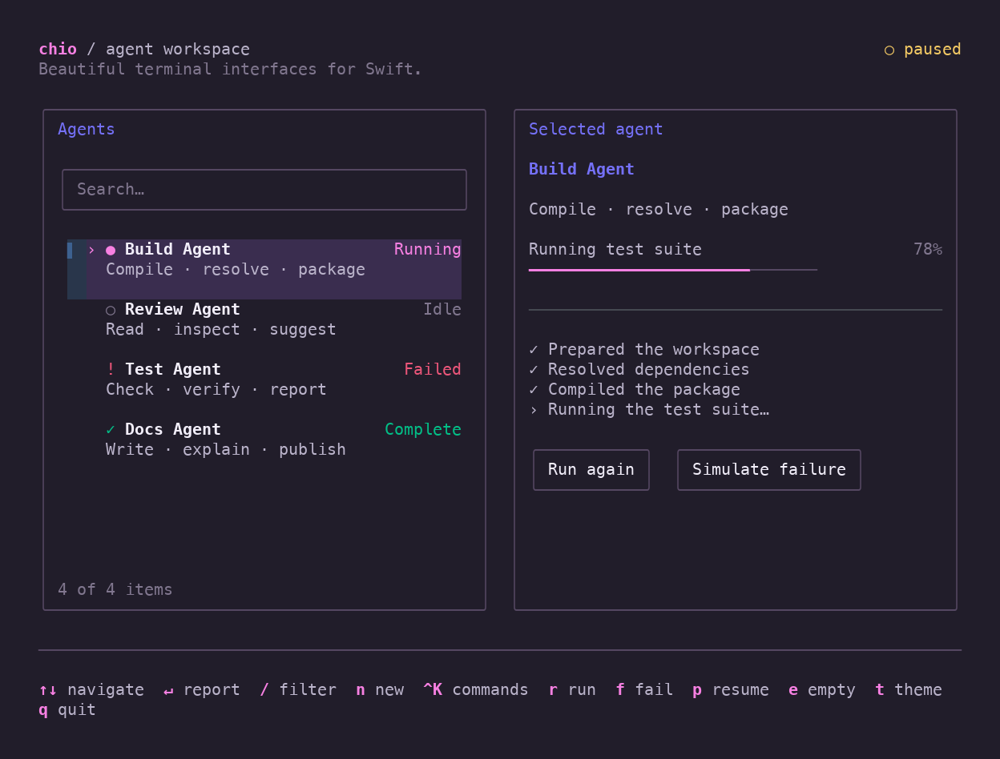

# Chio

**Beautiful terminal interfaces for Swift.**

*Chio* means attractive or pretty in Singlish. Chio is an opinionated, declarative
framework for polished terminal interfaces, built on [SwiftTUI](https://github.com/SwiftTUI/swift-tui).
Charm-inspired themes, searchable lists and checklists, form fields, file
selection, maps, and Markdown compose with native SwiftTUI views. SwiftTUI handles
rendering, layout, input, and focus.

[](https://echoz.github.io/Chio/)

[▶ Watch Chio in action](https://echoz.github.io/Chio/) · [Examples and controls](Docs/Examples.md)

## Development and stability

Chio is a **personal project built with Codex assistance and human curation**.
Codex contributes to implementation, tests, and documentation, while the human
maintainer guides the project's direction, design, and what to keep.

It is built primarily for personal use and shared for anyone who finds it useful.
We cannot vouch for its stability or suitability for production use. APIs and
behavior may change without notice. Automated tests cover specific workflows,
not every terminal, platform, or integration; evaluate it for your own needs
before relying on it.

## Build with Chio

```swift
import SwiftTUI
import Chio

struct AgentsView: View {
    let agents: [Agent] // Your Identifiable model, with a stable ID and name.
    @State private var selection: Agent.ID?

    var body: some View {
        GroupBox("Agents") {
            SearchableList(agents, selection: $selection, searchText: \.name) {
                Text($0.name)
            }
        }
        .chioTheme(.default)
    }
}
```

One theme gives your controls consistent colors, spacing, and focus styling.
[API usage and recipes →](Docs/Usage.md)

## Try it

Requires **Swift 6.4+**, on **macOS 15+ or Linux**. From a repository checkout:

```sh
swift run -c release chio-dashboard
```

Use arrows to navigate, `/` to filter, Enter to open a report, **Ctrl-K** for the
command palette, and `q` to quit. Release mode gives better interactive performance.
For true-color terminals over SSH, prefix the command with `COLORTERM=truecolor`.

Add `--choices`, `--text-entry`, `--feedback`, or `--files` to try a focused example.
Try world and street maps with locations and routes:

```sh
swift run -c release chio-maps --map street
# Add --online to load neighboring OpenFreeMap tiles as you pan.
```

[Example controls and launch options →](Docs/Examples.md)

## Inspiration

- [Charm](https://charm.sh/), especially Lip Gloss, Bubbles, Huh, and Glamour —
  cohesive themes, expressive controls, forms, and polished terminal typography.
- [btop++](https://github.com/aristocratos/btop) — compact panels, meters, history
  graphs, and information-dense layouts in the compact metrics example.
- [gh-dash](https://www.gh-dash.dev/) — dense collections, contextual navigation,
  and list/detail workspaces.
- [Hunk](https://www.hunk.dev/) — readable diffs and keyboard-driven review flows;
  the reference for the example-only diff reader prototype.
- [MapSCII](https://github.com/rastapasta/mapscii) — terminal cartography, explored
  in the [map component](Docs/Usage.md#maps).

Chio adapts these ideas to native SwiftTUI composition and Swift APIs.

## Documentation

- [API usage](Docs/Usage.md) — themes and component recipes
- [Examples](Docs/Examples.md) — controls, screenshots, and SSH guidance
- [Design](Docs/Design.md) — architecture and interaction contracts
- [Coverage](Docs/Releases/0.1.0.md#component-coverage) · [Plan](Docs/Plan.md) · [Development checks](Docs/Verification.md#running-checks)

Code: [MIT License](LICENSE). Bundled map data retains its
[source licenses](Examples/Maps/Fixtures/Provenance.md).
